# Ruta Contable

Aplicación web full-stack para gestión financiera de clubes y organizaciones.

[](https://nodejs.org)
[](https://react.dev)
[](https://www.typescriptlang.org)
[](https://www.postgresql.org)
[](https://www.docker.com)

> Este documento reemplaza y unifica: `DOCUMENTACION_TECNICA_RUTA_CONTABLE.md`, `DEPLOY_VERCEL.md`, `Vercel-README.md`, `guia_docker.md`, `backend/SECURITY.md`, `frontend/src/guidelines/Guidelines.md` y los `.md` de `frontend/src/images/`. Esos archivos se eliminaron; su contenido vive aquí, corregido contra el estado real del código y de la base de datos (verificado 2026-08-18 vía Supabase MCP + grep sobre el backend).

## Tabla de Contenidos

1. [Descripción](#descripción)
2. [Arquitectura](#arquitectura)
3. [Stack Tecnológico](#stack-tecnológico)
4. [Primeros Pasos](#primeros-pasos)
5. [Docker en Detalle](#docker-en-detalle)
6. [Estructura de Archivos](#estructura-de-archivos)
7. [Modelo de Datos](#modelo-de-datos)
8. [API Endpoints](#api-endpoints)
9. [Seguridad](#seguridad)
10. [Assets del Frontend](#assets-del-frontend)
11. [Despliegue](#despliegue)
12. [Mejoras Pendientes](#mejoras-pendientes)

---

## Descripción

Ruta Contable gestiona socios, transacciones, mensualidades, cartera morosa, compras y proveedores para clubes y organizaciones. Arquitectura de tres capas:

- **Frontend**: React 18, TypeScript y Tailwind CSS, arquitectura por características (`features/`)
- **Backend**: Node.js + Express, API REST
- **Base de datos**: PostgreSQL, alojada en Supabase (proyecto `hfibhmntifttdududwpw`)
- **Orquestación**: Docker Compose para desarrollo local

---

## Arquitectura

### Stack Dockerizado (desarrollo)

```
┌─────────────────────────────────────────────────────────────────────────────┐
│                         Ruta Contable (Docker Compose)                     │
├─────────────────────────────────────────────────────────────────────────────┤
│  ┌──────────────┐      HTTP/5173      ┌───────────────────────────────┐    │
│  │   Frontend   │◄────────────────────►│           Vite dev             │    │
│  │   (React)    │                      │       Puerto 3000→5173         │    │
│  └──────────────┘                      └──────────────┬────────────────┘    │
│                                                       │ /api proxy          │
│                                                       ▼                     │
│  ┌──────────────┐                       ┌───────────────────────────────┐    │
│  │   Backend    │◄──────────────────────│          Express API          │    │
│  │   (Node.js)  │      HTTP/3001        │       Puerto 3001              │    │
│  │   + nodemon  │                       │  (hot-reload en desarrollo)   │    │
│  └──────────────┘                       └──────────────┬────────────────┘    │
│                                                       │ pg driver           │
│                                                       ▼                     │
│  ┌──────────────┐                       ┌───────────────────────────────┐    │
│  │  PostgreSQL  │                       │    Volumen: pgdata              │    │
│  │   local      │                       │    (datos persistentes)         │    │
│  │  Puerto 5432 │                       └───────────────────────────────┘    │
│  └──────────────┘                                                          │
└─────────────────────────────────────────────────────────────────────────────┘
```

### ⚠️ Dos bases de datos distintas según cómo corras el backend

Esto **no está documentado en ningún otro lado del repo** y genera confusión real:

| Forma de correr el backend | `DB_HOST` efectivo | Base de datos |
|---|---|---|
| `docker compose up` | `postgres` (fijo en `docker-compose.yml`) | Postgres **local**, vacío, se llena solo con lo que cree `setupDatabase()` en `server.js` |
| `cd backend && npm run dev` (sin Docker) | valor de `backend/.env` → `aws-1-us-west-2.pooler.supabase.com` | Base de datos **real de Supabase** (producción), vía pooler |

Correr el backend fuera de Docker con el `.env` actual escribe directo contra la base de datos productiva del proyecto Supabase. Si necesitás un entorno aislado para probar, usá Docker Compose (que ignora `backend/.env` y fuerza `DB_HOST=postgres`) o apuntá `backend/.env` a una base de prueba antes de `npm run dev`.

### Flujo de desarrollo (Docker)

1. Editás código local (`./frontend`, `./backend`)
2. Bind mounts sincronizan los archivos dentro de los contenedores
3. Hot-reload recarga automáticamente (nodemon en backend, Vite en frontend)
4. `pgdata` persiste el Postgres local entre reinicios (no aplica al camino sin Docker, que usa Supabase)

### Arquitectura de seguridad

```
Frontend (React)
       │
       ▼
HTTPS / Nginx (producción)
       │
       ▼
Backend (Express + Helmet)
       │
       ▼
Validación y Sanitización
       │
       ▼
PostgreSQL (prepared statements, pg.Pool directo — sin cliente Supabase JS)
```

---

## Stack Tecnológico

### Frontend
| Tecnología | Versión | Propósito |
|------------|---------|-----------|
| React | 18.3.1 | UI |
| TypeScript | 5.x | Tipado estático |
| Vite | 6.x | Build tool / dev server |
| Tailwind CSS | 3.4.18 | Estilos |
| Radix UI | varias | Componentes accesibles sin estilos |
| Lucide React | 0.487.0 | Iconos SVG |
| Axios | 1.7.9 | Cliente HTTP |
| React Hook Form | 7.55.0 | Formularios |
| Recharts | 2.15.2 | Gráficos |
| @react-pdf/renderer | 4.3.2 | PDFs en cliente |
| Sonner | 2.0.3 | Toasts |

### Backend
| Tecnología | Versión | Propósito |
|------------|---------|-----------|
| Node.js | 18+ | Runtime |
| Express | 5.x | Framework HTTP / API REST |
| pg (node-postgres) | 8.x | Driver PostgreSQL directo (sin ORM, sin cliente Supabase) |
| jsonwebtoken | 9.x | Autenticación JWT |
| bcryptjs | 3.x | Hash de contraseñas (12 rounds) |
| helmet | 8.x | Cabeceras de seguridad HTTP |
| cors | 2.8.6 | Control de acceso entre orígenes |
| express-rate-limit | 8.x | Rate limiting |
| morgan | 1.x | Logging de peticiones |
| nodemailer | 9.x | Envío de correo (recuperación de contraseña) |
| nodemon | — | Hot-reload (solo desarrollo) |

### Infraestructura
| Componente | Uso |
|---|---|
| Docker + Docker Compose | Entorno de desarrollo local aislado |
| Supabase (Postgres 17) | Base de datos real del proyecto, `hfibhmntifttdududwpw` |
| Vercel | Hosting del frontend estático |
| Render | Hosting del backend (Node + Express) |

---

## Primeros Pasos

### Con Docker (aislado, recomendado para probar sin tocar producción)

**Requisitos:** [Docker Desktop](https://www.docker.com/products/docker-desktop/), 4 GB RAM / 2 CPU asignados.

```bash
git clone <repo-url>
cd ruta-contable
cp .env.example .env
docker compose up --build
```

Levanta:
- Frontend: http://localhost:3000
- Backend: http://localhost:3001
- PostgreSQL local: localhost:5432 (vacío, ver nota arriba)

```bash
docker compose logs -f   # logs en vivo
docker compose down      # apagar sin borrar datos
```

> No uses `docker compose down -v` salvo que quieras borrar el volumen `pgdata`.

### Sin Docker (conecta directo a Supabase — ver advertencia arriba)

**Requisitos:** Node.js 18+, npm.

```bash
cd backend && npm install
cd ../frontend && npm install
```

`backend/.env` ya apunta al pooler de Supabase (`DB_HOST`, `DB_USER`, `DB_PASSWORD` de ese proyecto). No hace falta PostgreSQL local para este camino.

```bash
# Terminal 1
cd backend && npm run dev
# Terminal 2
cd frontend && npm run dev
```

- Frontend: http://localhost:5173 (Vite)
- Backend: http://localhost:3001

---

## Docker en Detalle

### Conceptos

| Término | Descripción |
|---------|-------------|
| **Imagen** | Plantilla inmutable (código + dependencias + config) |
| **Contenedor** | Instancia en ejecución de una imagen |
| **Dockerfile** | Instrucciones para armar una imagen |
| **Docker Compose** | Define y corre múltiples contenedores a la vez |
| **Volumen** | Almacenamiento persistente, sobrevive al contenedor |
| **Bind Mount** | Monta una carpeta del host dentro del contenedor (desarrollo) |

### Volúmenes usados en este proyecto

| Tipo | Ejemplo | Uso |
|------|---------|-----|
| Volumen nombrado | `pgdata:/var/lib/postgresql/data` | Datos del Postgres local, persiste entre reinicios |
| Bind mount | `./backend:/app`, `./frontend:/app` | Código fuente, cambios locales reflejados al instante |
| Volumen anónimo | `/app/node_modules` | Evita que el host sobrescriba los módulos instalados dentro del contenedor |

### Hot-reload

- **Backend**: bind mount + `nodemon` reinicia el proceso Express al detectar cambios en `.js`. `CHOKIDAR_USEPOLLING=true` y `WATCHPACK_POLLING=true` fuerzan *polling* porque en Windows/Mac los eventos nativos de filesystem no siempre llegan a través de Docker.
- **Frontend**: Vite corre dentro del contenedor en el puerto 5173, mapeado a `3000` del host.

### Qué hace `docker compose up --build`

1. Lee `.env` de la raíz y carga variables (`DB_NAME`, `DB_USER`, `JWT_SECRET`, etc. — usadas solo por el Postgres **local**, no por Supabase)
2. Arma las imágenes desde `Dockerfile.dev` de `backend` y `frontend`
3. Levanta `postgres`, espera `pg_isready`; luego `backend`; luego `frontend`
4. Monta volúmenes (`pgdata`, bind mounts, anónimos para `node_modules`)
5. Inyecta variables de entorno por servicio
6. Ejecuta `npm run dev` en cada uno

### Cuándo usar `--build`

| Escenario | Comando |
|-----------|---------|
| Primera vez | `docker compose up --build` |
| Cambiaste `Dockerfile` o instalaste dependencia nueva | `docker compose up --build` |
| Solo cambiaste código fuente | `docker compose up` |

### Comandos útiles

```bash
docker compose up -d                                          # segundo plano
docker compose down                                           # apagar, conserva datos
docker compose down -v                                        # apagar y borrar volumen (⚠ pierde datos)
docker compose logs -f [servicio]                              # logs en vivo
docker compose ps                                              # estado de servicios
docker compose exec backend sh                                 # shell en backend
docker compose exec backend npm install <paquete>               # instalar dependencia
docker compose exec postgres psql -U postgres -d ruta_contable1 # conectar al Postgres local
```

### Resetear el Postgres local

```bash
# Conservar el volumen pero borrar tablas
docker compose exec postgres psql -U postgres -d ruta_contable1 -c "DROP SCHEMA public CASCADE; CREATE SCHEMA public;"

# Eliminar el volumen y recrear (pierde TODO lo local)
docker compose down -v
docker compose up --build
```

### Troubleshooting

| Síntoma | Causa | Solución |
|---|---|---|
| `Bind for 0.0.0.0:3000 failed: port is already allocated` | Otro proceso usa el puerto | Windows: `netstat -ano \| findstr ":3000"` → `taskkill /PID <PID> /F`. O cambiar el mapeo de puertos en `docker-compose.yml` |
| Hot-reload no funciona en Windows | Eventos `fs.watch` no se propagan bien en Docker Desktop | Ya mitigado con `CHOKIDAR_USEPOLLING`/`WATCHPACK_POLLING`; si persiste, subir `CHOKIDAR_INTERVAL` |
| Base de datos se resetea sola | Se usó `docker compose down -v` | No usar `-v` salvo que sea intencional |
| Build lento | Rebuild innecesario, `.dockerignore` incompleto | Usar `docker compose up` sin `--build` si no cambió `Dockerfile`/`package.json` |
| CORS bloqueado en el navegador | `CORS_ORIGIN` no coincide con el puerto del frontend | Verificar `CORS_ORIGIN` en `docker-compose.yml`/`.env` |
| No conecta desde DBeaver/pgAdmin a `localhost:5432` | Puerto no mapeado o DB no lista | `docker compose ps`, si falta recrear con `docker compose up --build` |

### Buenas prácticas

- No commitear `.env` (ya está en `.gitignore`); usar `.env.example` como plantilla
- `healthcheck` en Postgres para que el backend espere a que esté listo
- Volúmenes anónimos para `node_modules`
- Variables públicas del frontend deben empezar con `VITE_` (todo lo demás queda expuesto en el bundle)
- Imágenes `-alpine`/`-slim`
- `docker system prune` periódico para liberar espacio

---

## Estructura de Archivos

```
Ruta contable/
├─ frontend/
│   ├── src/
│   │   ├── App.tsx
│   │   ├── main.tsx
│   │   ├── features/            # auth, landing, admin (por característica)
│   │   ├── components/
│   │   ├── contexts/            # Auth, Data
│   │   ├── hooks/                # useAuth, useStats, useCrudState, useAlerts
│   │   ├── pages/                # legacy
│   │   ├── types/
│   │   └── utils/
│   ├── public/
│   ├── Dockerfile / Dockerfile.dev
│   └── vite.config.ts
│
├── backend/
│   ├── controllers/
│   ├── middleware/               # JWT, roles
│   ├── routes/
│   ├── utils/
│   ├── logs/                     # logs de seguridad
│   ├── server.js                 # servidor Express + montaje de rutas
│   ├── db.js                     # pool PostgreSQL (Supabase pooler)
│   ├── Dockerfile / Dockerfile.dev
│   └── .env
│
├── .env / .env.example / .env.docker
├── docker-compose.yml
└── README.md                     # este archivo
```

---

## Modelo de Datos

Extraído en vivo del esquema `public` de Supabase (20 tablas), contrastado contra las consultas SQL reales del backend — no contra migraciones ni el diagrama académico que traía `DOCUMENTACION_TECNICA_RUTA_CONTABLE.md` (ese archivo describía tablas ficticias — `plan_cuentas`, `comprobante_contable`, `detalle_comprobante` — que **no existen** en la base real; se descartó al unificar).

### Diagrama (Mermaid)

```mermaid
erDiagram
    %% ===================== IDENTIDAD Y CONFIGURACION =====================
    users ||--o{ socio              : "created_by"
    users ||--o{ transactions       : "created_by"
    users ||--o{ compra             : "created_by"
    users ||--o{ compra             : "approved_by"
    users ||--o{ factura            : "created_by"
    users ||--o{ proveedores        : "created_by"
    users ||--o{ meses_periodo      : "cerrado_by"
    users ||--o{ config_mensualidad : "created_by (sin uso)"

    %% ===================== SOCIOS =====================
    socio ||--o{ pago_mensual       : tiene
    socio ||--o{ cartera            : tiene
    socio ||--o{ camerino           : tiene
    socio ||--o{ asistencia         : registra
    socio ||--o{ poliza_salud       : tiene
    socio ||--o{ pedido_jersey      : hace
    socio ||--o{ detalle_transaccion: referencia
    users ||--o{ asistencia         : "registrado_by"

    %% ===================== CONTABILIDAD =====================
    categories ||--o{ transactions  : clasifica
    meses_periodo ||--o{ pago_mensual : agrupa
    transactions ||--o{ detalle_transaccion : desglosa
    transactions ||--o| pago_mensual : concilia
    transactions ||--o| cartera     : concilia
    pago_mensual ||--o{ cartera     : "origina mora"

    %% ===================== COMPRAS Y PROVEEDORES =====================
    categories ||--o{ compra        : clasifica
    proveedores ||--o{ compra       : provee
    proveedores ||--o{ factura      : provee
    compra ||--o{ detalle_compra    : contiene
    compra ||--o{ factura           : genera
    factura ||--o{ detalle_factura  : contiene
    transactions ||--o| compra      : concilia
    transactions ||--o| factura     : concilia

    %% ===================== SERVICIOS AL SOCIO =====================
    pedido_jersey ||--o{ inventario_jersey : entrega
    users ||--o{ inventario_jersey  : "recibido_by"
    transactions ||--o| camerino    : concilia
    transactions ||--o| poliza_salud: concilia

    %% ===================== TIENDA =====================
    categoria_producto ||--o{ products : clasifica

    users {
        int id PK
        varchar username UK
        varchar email UK
        varchar role
        bool active
    }
    config_mensualidad {
        int id_config PK
        int anio UK
        numeric valor_mensual
        int created_by FK
    }
    socio {
        int id_socio PK
        varchar documento UK
        varchar nombre
        varchar tipo_membresia
        varchar estado
        int created_by FK
    }
    transactions {
        int id PK
        varchar tipo "ingreso|gasto"
        numeric monto
        date fecha
        int categoria_id FK
        int created_by FK
    }
    categories {
        int id PK
        varchar name
        varchar type "income|expense"
    }
    meses_periodo {
        int id_periodo PK
        int anio
        smallint mes
        bool cerrado
        int cerrado_by FK
    }
    pago_mensual {
        int id_pago PK
        int id_socio FK
        int id_periodo FK
        varchar estado "pendiente|pagado|moroso|exento|cancelado"
        int id_transaccion FK
    }
    cartera {
        int id_cartera PK
        int id_socio FK
        int id_pago_mensual FK
        varchar estado "pendiente|pagado|anulado"
        int id_transaccion FK
    }
    detalle_transaccion {
        int id_detalle PK
        int id_transaccion FK
        int id_socio FK
        numeric monto
    }
    proveedores {
        int id_proveedor PK
        varchar nombre UK
        varchar estado
        int created_by FK
    }
    compra {
        int id_compra PK
        varchar concepto
        varchar estado "pendiente|aprobada"
        int categoria_id FK
        int id_proveedor FK
        int id_transaccion FK
        int created_by FK
        int approved_by FK
    }
    detalle_compra {
        int id_compra PK,FK
        int nro_linea PK
        varchar concepto
        int cantidad
        numeric valor_unitario
    }
    factura {
        int id_factura PK
        varchar numero_factura
        varchar estado "Pendiente|Pagada|Anulada"
        int id_compra FK
        int id_proveedor FK
        int id_transaccion FK
        int created_by FK
    }
    detalle_factura {
        int id_factura PK,FK
        int nro_linea PK
        varchar servicio
        numeric valor_total "generada"
    }
    camerino {
        int id_camerino PK
        int id_socio FK
        varchar estado "Asignado|Pagado|Vencido|Liberado"
        int id_transaccion FK
    }
    asistencia {
        int id_asistencia PK
        int id_socio FK
        varchar estado "Presente|Ausente|Justificado|Tarde"
        int registrado_by FK
    }
    poliza_salud {
        int id_poliza PK
        int id_socio FK
        varchar tipo "Basica|Premium|Familiar"
        int id_transaccion FK
    }
    pedido_jersey {
        int id_pedido PK
        int id_socio FK
        varchar estado "Solicitado..Entregado"
    }
    inventario_jersey {
        int id_inventario PK
        int id_pedido FK
        varchar estado_entrega
        int recibido_by FK
    }
    categoria_producto {
        int id PK
        varchar nombre UK
    }
    products {
        int id PK
        varchar name
        numeric price
        int stock
        int categoria_id FK
    }
```



### Discrepancias esquema vs. código (verificado por grep sobre `backend/`)

| Hallazgo | Detalle |
|---|---|
| **`periodos` muerta** | 0 FK, 0 filas. El propio `server.js:155` comenta: *"meses_periodo (reemplaza a la extinta tabla periodos)"*. `PeriodoController.js` solo consulta `meses_periodo`. Candidata a `DROP TABLE`. |
| **`config_mensualidad` sin uso** | FK completa a `users`, pero ningún controller ni route la referencia (`grep` sobre `backend/` no da resultados). |
| **`factura` / `detalle_factura` sin módulo propio** | Las tablas existen con FKs a `compra`/`proveedores`/`transactions`, pero no hay `FacturaController.js` ni `routes/facturas.js`. `CompraController.js` solo usa `factura` como *campo de texto suelto* dentro de `compra`, nunca toca la tabla `factura` real. Ver [dónde agregarlo](#módulo-de-factura-pendiente). |
| **`camerino` y `poliza_salud` sin uso** | Cero referencias en `backend/controllers` o `backend/routes`. Tablas listas, sin API. |
| **`pedido_jersey` / `inventario_jersey` de solo lectura** | `InventarioController.js` (línea ~175) las consulta con un `SELECT` de solo lectura; no hay create/update/delete. |
| **Dos configuraciones paralelas** | `system_data` (singleton `id=1`, activo, usado por `ClubDataController.js`) vs `config_mensualidad` (por año, sin uso). No se referencian entre sí — dominios distintos (datos generales del club vs. valor de mensualidad). |
| **`compra` tiene doble FK a `users`** | `created_by` (quien registra) y `approved_by` (quien aprueba), coherente con el flujo `estado: pendiente → aprobada`. |

### Módulo de factura (pendiente)

Patrón consistente con `compras`/`proveedores` — 1 controller + 1 route por recurso:

- `backend/controllers/FacturaController.js` — CRUD de `factura` + `detalle_factura`, mismo patrón que `CompraController.js` usa para `detalle_compra`
- `backend/routes/facturas.js` — montado en `/api/facturas`
- Registrar en `server.js` junto a `compraRoutes`/`proveedorRoutes`

---

## API Endpoints

Rutas montadas realmente en `server.js` (13 módulos + `/health`):

| Prefijo | Route file | Controller |
|---|---|---|
| `/api/auth` | `routes/auth.js` + `routes/forgotPassword.js` | login, registro, recuperación de contraseña |
| `/api/users` | `routes/users.js` | CRUD usuarios (admin) |
| `/api/socios` | `routes/Member.js` | CRUD socios |
| `/api/admin` | `routes/admin.js` | operaciones de administración |
| `/api/transactions` | `routes/Transaction.js` | CRUD transacciones, export CSV |
| `/api/proveedores` | `routes/proveedores.js` | CRUD proveedores |
| `/api/compras` | `routes/compras.js` | CRUD compras + `detalle_compra` |
| `/api/inventario` | `routes/inventario.js` | `products`, `categoria_producto`, lectura de `pedido_jersey`/`inventario_jersey` |
| `/api/cartera` | `routes/cartera.js` | consulta y actualización de cartera morosa |
| `/api/asistencia` | `routes/asistencia.js` | control de asistencia |
| `/api/periodos` | `routes/periodos.js` | CRUD `meses_periodo` (pese al nombre de la ruta) |
| `/api/pagos-mensuales` | `routes/pagosMensuales.js` | generación y pago de mensualidades |
| `/api/categories` | `routes/categories.js` | CRUD categorías |
| `/api/club-data` | `routes/clubData.js` | `system_data` (singleton) |
| `GET /health` | inline en `server.js` | health check |

Sin cobertura de API: `factura`, `detalle_factura`, `camerino`, `poliza_salud`, `config_mensualidad` (ver [Modelo de Datos](#modelo-de-datos)).

---

## Seguridad

### Medidas implementadas

| Capa | Implementación |
|------|----------------|
| Helmet | Headers de seguridad HTTP |
| CORS | Configuración estricta por origen |
| Rate Limiting | Protección contra fuerza bruta |
| Hashing | bcrypt (12 rounds) |
| JWT | Tokens con expiración |
| Bloqueo de cuenta | 5 intentos fallidos → bloqueo 15 min |
| SQL | Consultas parametrizadas (sin concatenación) |

### Por qué las políticas RLS de Supabase no son la capa de autorización real

`backend/db.js` conecta a Postgres directo con `pg.Pool`, usando las credenciales `DB_HOST`/`DB_USER`/... de `backend/.env` — **no** se usa `@supabase/supabase-js` en ningún punto del backend. El frontend tampoco importa ningún cliente de Supabase: toda la aplicación pasa exclusivamente por este backend Express.

Verificado el 2026-08-16 contra el proyecto `hfibhmntifttdududwpw`:

```sql
SELECT rolname, rolsuper, rolbypassrls FROM pg_roles WHERE rolname = 'postgres';
-- rolname=postgres  rolsuper=false  rolbypassrls=true
```

El rol `postgres.<project-ref>` usado por el pool (formato pooler de Supabase) tiene `rolbypassrls = true`: **bypasea RLS siempre**, sin importar cuántas políticas existan. Aunque el advisor de seguridad de Supabase marca las tablas con "RLS enabled, no policy", escribir políticas ahí no añade protección real, porque el único cliente que existe hoy nunca las evalúa.

La capa de autorización real vive en el middleware de Express (`backend/middleware/`, JWT + roles). Ahí es donde hay que revisar/reforzar permisos, no en RLS.

**Si esto cambia en el futuro:** si se agrega un cliente que hable directo con Supabase (frontend con `@supabase/supabase-js`, una edge function, un servicio externo con API key `anon`/`service_role` distinta del rol del pool), esta decisión debe revisarse — en ese escenario RLS sí sería la única barrera entre ese cliente nuevo y los datos, y las tablas necesitarían políticas reales antes de exponer esa vía.

### Middleware de autenticación (patrón real)

```javascript
// backend/middleware/auth.js
async function requireAdmin(req, res, next) {
  const authHeader = req.headers.authorization;
  if (!authHeader) {
    return res.status(401).json({ success: false, message: 'Token requerido' });
  }
  const token = authHeader.split(' ')[1];
  try {
    const decoded = jwt.verify(token, process.env.JWT_SECRET);
    if (decoded.role !== 'admin') {
      return res.status(403).json({ success: false, message: 'Acceso denegado' });
    }
    req.user = decoded;
    next();
  } catch (error) {
    return res.status(401).json({ success: false, message: 'Token inválido' });
  }
}
```

---

## Assets del Frontend

### `frontend/src/images/`

- `logo/` — logos del club y de la app
- `icons/` — iconos personalizados
- `backgrounds/` — imágenes de fondo
- `avatars/` — fotos de perfil por defecto
- `documents/` — imágenes de documentos o reportes

Formatos recomendados: logo PNG con fondo transparente (mín. 256×256px, máx. 512×512px), iconos SVG o PNG en varios tamaños, fondos JPG/WebP optimizados, avatares cuadrados.

```jsx
import logo from '/images/logo/club-logo.png'
// o
<ImageWithFallback src="/images/logo/club-logo.png" alt="Logo del Club" />
```

### Activar el logo del club

1. Colocar el archivo en `frontend/src/images/logo/club-logo.png` (PNG transparente, 256–512px)
2. En `components/Logo.tsx`, cambiar `const hasLogo = false` a `const hasLogo = true`
3. Si el nombre de archivo difiere, ajustar `logoPath` en el mismo componente
4. El logo se aplica automáticamente en header, login y donde se use `<Logo />`

Para logos vectoriales: guardar como `.svg` en la misma carpeta y actualizar la ruta en `Logo.tsx`.

---

## Despliegue

El repo es un **monorepo** (`backend/` + `frontend/`) y cada mitad se despliega en una plataforma distinta. Un `push` a `main` dispara el despliegue en ambas: no hay ningún paso manual.

| Pieza | Plataforma | URL de producción |
|---|---|---|
| Frontend (React + Vite, estático) | Vercel | https://ruta-contable-samuelgy2s-projects.vercel.app |
| Backend (Node + Express) | Render | https://ruta-contable.onrender.com |
| Base de datos (PostgreSQL) | Supabase | proyecto `hfibhmntifttdududwpw` |

Comprobación rápida de que el backend está vivo:

```bash
curl https://ruta-contable.onrender.com/health
# {"status":"OK","message":"Servidor funcionando"}
```

> **Ojo con `https://ruta-contable.vercel.app`.** Esa URL **no pertenece a este proyecto** y responde `404: DEPLOYMENT_NOT_FOUND`. Es el enlace que figura en el campo *About* del repositorio en GitHub, y por eso parece que el despliegue está caído. La URL buena es la de la tabla de arriba.

### Configuración de Vercel

El despliegue está descrito en `vercel.json`, en la **raíz** del repositorio:

```json
{
  "$schema": "https://openapi.vercel.sh/vercel.json",
  "framework": "vite",
  "installCommand": "npm install --prefix frontend",
  "buildCommand": "npm run build --prefix frontend",
  "outputDirectory": "frontend/build",
  "rewrites": [
    { "source": "/(.*)", "destination": "/index.html" }
  ]
}
```

- `outputDirectory` es `frontend/build` y **no** `frontend/dist` porque `frontend/vite.config.ts` define `build.outDir: 'build'`.
- Los `rewrites` mandan cualquier ruta a `index.html`: sin ellos, recargar en `/login` o `/admin` da 404.
- **El Root Directory del panel de Vercel debe quedarse en `/`.** Si se cambia a `frontend`, Vercel ignora el `vercel.json` de la raíz y usa `frontend/vercel.json`, que solo contiene el rewrite: se pierden los comandos de build.

### Variables de entorno (pendientes de configurar a mano)

| Plataforma | Variable | Valor |
|---|---|---|
| Vercel | `VITE_API_URL` | `https://ruta-contable.onrender.com` |
| Render | `CORS_ORIGIN` | `https://ruta-contable-samuelgy2s-projects.vercel.app` |

`VITE_API_URL` es una variable de **build**: Vite la sustituye al compilar, así que después de crearla o cambiarla hay que **volver a desplegar** para que surta efecto.

### Cómo se resuelve la URL del backend

Un único módulo decide a qué backend apunta el frontend: `frontend/src/services/apiConfig.ts`.

```ts
import { API_URL } from '../../services/apiConfig';

const res = await fetch(`${API_URL}/admin/overview`, { ... });
```

- `API_BASE` es el origen del backend, sin barra final y sin sufijo.
- `API_URL` es `API_BASE + '/api'`, o sea la raíz de la API REST: las rutas cuelgan de ahí sin repetir `/api`.
- Sin `VITE_API_URL` definida: en desarrollo se usa ruta relativa y el proxy de `vite.config.ts` reenvía `/api` al `localhost:3001`; en producción se recurre al backend de Render.

**No leas `import.meta.env.VITE_API_URL` en componentes nuevos.** Importa `API_URL` de `apiConfig.ts`. Antes había seis archivos resolviendo la URL por su cuenta con valores por defecto distintos, y parte de la aplicación acababa llamando a `http://localhost:3001` en producción, es decir al equipo de quien visitaba la página.

### Checklist de despliegue

- [ ] Root Directory de Vercel = `/`
- [ ] `VITE_API_URL` configurada en Vercel + redeploy ejecutado
- [ ] `CORS_ORIGIN` configurada en Render
- [ ] Rutas internas (`/login`, `/admin`) cargan sin 404
- [ ] `GET /health` del backend responde `OK`

### Bundle grande (advertencia real del build)

```
assets/index-C_u4hTQW.js   1,938.82 kB │ gzip: 633.92 kB
```

Recomendación: code-splitting con lazy loading de rutas para bajar el chunk principal de 500 kB.

### Problemas comunes

| Error | Causa | Solución |
|---|---|---|
| `404: DEPLOYMENT_NOT_FOUND` | Se está entrando por `ruta-contable.vercel.app`, que no es de este proyecto | Usar `https://ruta-contable-samuelgy2s-projects.vercel.app` y corregir el campo *About* del repositorio |
| El build no ejecuta `npm run build` | Root Directory apunta a `frontend`, así que se aplica `frontend/vercel.json` | Devolver el Root Directory a `/` |
| Rutas internas dan 404 al recargar | Falta el rewrite SPA | Confirmar el bloque `rewrites` de `vercel.json` |
| Las peticiones van a `localhost:3001` | `VITE_API_URL` no estaba definida al compilar | Definirla en Vercel y **volver a desplegar** |
| CORS bloquea las peticiones | `CORS_ORIGIN` de Render no incluye el dominio de Vercel | Actualizar `CORS_ORIGIN` en Render |
| Primera petición muy lenta | El plan gratuito de Render duerme el servicio tras un rato inactivo | Esperar al arranque en frío (~30 s) |
| Base de datos no conectada | Variables del backend mal configuradas | Revisar `DB_HOST`/`DB_USER`/`DB_PASSWORD` en Render |

---

## Mejoras Pendientes

- [ ] Módulo de `factura`/`detalle_factura` (ver [arriba](#módulo-de-factura-pendiente))
- [ ] API para `camerino` y `poliza_salud` (tablas listas, sin endpoints)
- [ ] CRUD completo para `pedido_jersey`/`inventario_jersey` (hoy solo lectura)
- [ ] Decidir destino de `periodos` (drop) y `config_mensualidad` (usar o eliminar)
- [ ] HTTPS con certificados SSL en producción
- [ ] Protección CSRF
- [ ] JWT con refresh tokens
- [ ] Pruebas unitarias y de integración
- [ ] Documentación con Swagger/OpenAPI
- [ ] Code-splitting del frontend (bundle > 1.9 MB)

### Cambios recientes
- [x] Alertas automáticas para pagos pendientes/vencidos (hook `useAlerts`)

---

**Última actualización:** 2026-08-18
